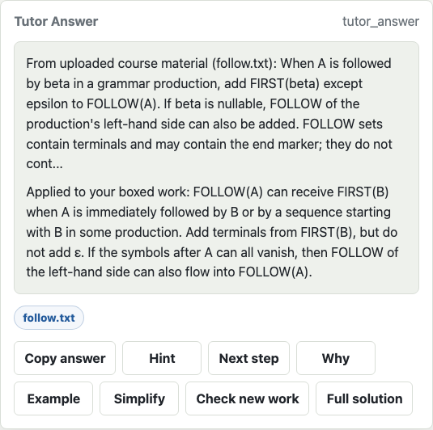

# Study Companion

A local study app that keeps tutoring questions, course excerpts and session notes together. The browser UI connects to a TypeScript/Express server with streamed file uploads, lexical retrieval, source labels and Markdown export.

The default demo uses a deterministic mock tutor. No model account, API key or external service is needed to try it. This version is a runnable Mac/web prototype; it does not capture Goodnotes screens or recognize handwriting.

## Try it

Use Node.js 22 or 24 with npm and a macOS or Linux shell. Run these commands from the repository root:

```sh
cd mac-server
npm ci --ignore-scripts
npm run build
npm run smoke
TUTOR_PROVIDER=mock HOST=127.0.0.1 PORT=3000 npm run dev
```

Open **http://127.0.0.1:3000/**. If another app uses port 3000, set a different `PORT` and open that address. Stop the demo with Ctrl-C. The smoke command starts and closes its own temporary server and does not need the interactive app running.

For a short walkthrough with sample course material, see [Review the project](docs/PROJECT_REVIEW.md). For provider configuration, LAN pairing and detailed API examples, see the [usage reference](docs/usage-reference.md).



*Example from the deterministic mock demo. The source label refers to the uploaded sample file.*

## What to inspect

| Feature | Behavior | Code |
| --- | --- | --- |
| Course uploads | Text-like files stream to local storage, then become labelled excerpts for retrieval. | [Course service](mac-server/src/rag/CourseService.ts), [HTTP routes](mac-server/src/server.ts) |
| Retrieval | Query terms rank chunks within the selected course. Returned excerpts retain their source identity. | [Retrieval implementation](mac-server/src/rag/CourseService.ts), [RAG tests](mac-server/src/rag/courseRoutes.test.ts) |
| Tutor flow | A bare question marker asks the user to choose an intent; the selected intent produces a response. | [Request flow](mac-server/src/server.ts), [prompt construction](mac-server/src/tutor/PromptBuilder.ts) |
| Provider boundary | The optional CLI adapter serializes requests, enforces a timeout and reports structured failures. | [Queued adapter](mac-server/src/providers/CodexPrivateLocalProvider.ts), [adapter tests](mac-server/src/providers/CodexPrivateLocalProvider.test.ts) |
| Session notes | The UI keeps a turn history and exports it to Markdown. | [Session state](mac-server/src/session/TutorStateStore.ts), [Markdown formatting](mac-server/src/session/SessionMarkdown.ts) |

The engineering walkthrough explains these choices and their limits. Source labels identify supplied context; they do not prove an answer is correct. The mock tutor demonstrates the workflow, not general-purpose tutoring quality.

## Check the build

From `mac-server`:

```sh
npm test
npm run build
npm run simulate
npm run smoke
```

The tests use temporary data and fake provider responses. The smoke run exercises uploads, retrieval, intent selection, source-labelled answers, session history and cleanup over HTTP. See [validation](docs/REVIEW_VALIDATION.md) for the checked source revision and results, and [testing](docs/testing.md) for individual routes.

[GitHub Actions](.github/workflows/validate.yml) runs these four checks on macOS and Ubuntu with Node.js 22 and 24. Its nested checkout also exercises the test-launch path that previously failed on macOS.

## Scope and storage

Course files and indexes are stored under the ignored `data/` directory. Tutor history is held in memory and resets when the server stops; export notes before stopping. Uploaded PDFs that need OCR are labelled accordingly. Manual screenshot uploads need supplied text because this version has no OCR.

The server binds to loopback by default. LAN mode requires a pairing token. The optional model-provider path must be explicitly selected; model requests then use that configured provider. The default mock demo makes no model calls.

This prototype has no signed iOS app, ReplayKit capture, picture-in-picture, durable tutor sessions or hosted deployment. It is an independent companion, not a Goodnotes product. Read the [architecture](docs/architecture.md) for component boundaries and the [usage reference](docs/usage-reference.md) for other available controls.
