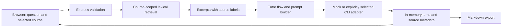

# Review the project

This walkthrough demonstrates the public 0.1 codebase with synthetic course material and the default mock tutor. It requires no account, API key or personal notes.

## Five-minute walkthrough

Start the app using the [README commands](../README.md#try-it).

1. In **Course Material**, create a course named `Parsing demo` with description `FIRST and FOLLOW sets`.
2. Save the text below as `follow.txt`, then choose it under **Course files** and click **Upload files**.
3. Enter `FOLLOW FIRST epsilon` in **Retrieval query**, then click **Preview retrieval**. Inspect the returned excerpt and its source label.
4. Enable course grounding. In **Simulate Detection**, enter `FOLLOW(A) includes FIRST(B)` as the boxed text, choose `?` as the marker and click **Simulate**. Choose an intent when the options appear.
5. Inspect the answer and source labels, then choose **Download .md** in **History**. Open the downloaded notes and compare them with the visible session.

```text
When A is followed by beta in a grammar production, add FIRST(beta)
except epsilon to FOLLOW(A). If beta is nullable, FOLLOW of the
production's left-hand side can also be added. FOLLOW sets contain
terminals and may contain the end marker; they do not contain epsilon.
```

The mock tutor uses predefined behavior. The useful evidence here is the request, retrieval and session flow. An answer appearing on screen does not validate a general language model or arbitrary course content.

## How a grounded request moves through the app



## Three design decisions

**Stream course files before indexing.** The upload route can pass raw text-like bodies into a file stream. The course service then reads supported content, splits it into overlapping chunks and retains source labels. This avoids treating every upload as an in-memory JSON envelope. Extraction and indexing still read text into memory; it is not an unbounded-file pipeline.

**Keep retrieval inspectable.** Query terms and a phrase score rank chunks from the active course. A retrieval preview makes it possible to see which passages were selected before asking the tutor. The tradeoff is limited recall for paraphrases and language variation: this is lexical retrieval, not embedding search or a measured semantic-retrieval system.

**Put the model behind a narrow interface.** The mock and optional CLI providers implement the same request/response interface. The CLI adapter chains requests through a promise queue, runs one at a time, and converts timeouts or execution failures into explicit error responses. Fake runners make these paths testable without invoking the real model service. The queue is in memory and does not survive a process restart.

## Evidence map

| Claim | Inspect | Limit |
| --- | --- | --- |
| Streamed course uploads and labelled retrieval | [Course service](../mac-server/src/rag/CourseService.ts), [route tests](../mac-server/src/rag/courseRoutes.test.ts) | Public snapshot has simple file-backed indexes; it does not demonstrate safe concurrent writers or atomic recovery. |
| Compact context across turns | [Prompt builder](../mac-server/src/tutor/PromptBuilder.ts), [tests](../mac-server/src/tutor/PromptBuilder.test.ts) | Context is bounded by implementation choices; no learning-outcome claim is made. |
| Serial provider execution and timeout handling | [CLI provider](../mac-server/src/providers/CodexPrivateLocalProvider.ts), [tests](../mac-server/src/providers/CodexPrivateLocalProvider.test.ts) | Fake-runner validation does not prove real provider availability or model quality. |
| Exportable session notes | [Markdown formatter](../mac-server/src/session/SessionMarkdown.ts), [tests](../mac-server/src/session/SessionMarkdown.test.ts) | Session state itself is not durable. |
| End-to-end API behavior | [Smoke script](../mac-server/src/scripts/smoke.ts) | Synthetic fixtures on a temporary localhost server; no production load or user study. |

For exact commands and observed results, read [validation](REVIEW_VALIDATION.md).
